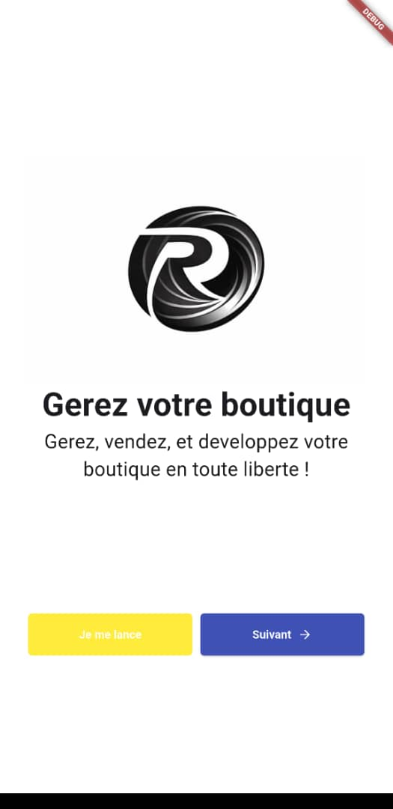
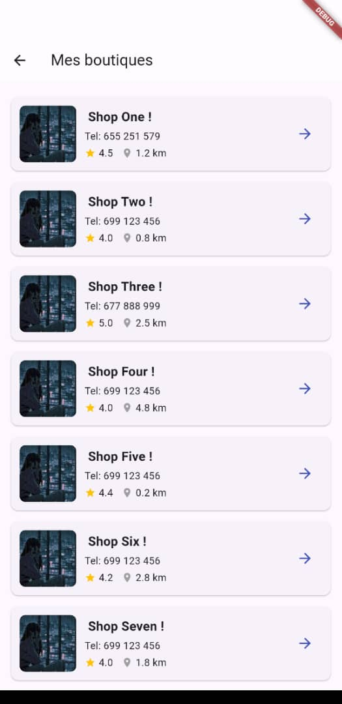

# Boutique

[](https://flutter.dev/)
[](LICENSE)

Application mobile Flutter pour gérer une boutique locale, visualiser des produits, et naviguer facilement entre les boutiques.

---

## 📌 Fonctionnalités principales

- **Écran d’accueil (`HomePage`)** :
  - Logo et slogan
  - Boutons "Je me lance" et "Suivant" avec icône
- **Écran liste de boutiques (`EventPage`)** :
  - Affichage d’une liste de boutiques ou produits
  - Chaque élément affiche :
    - Image / logo
    - Nom de la boutique
    - Numéro de téléphone
    - Nombre d’étoiles (rating)
    - Distance
    - Bouton “>” pour accéder aux détails
- **Navigation entre les pages** avec `Navigator.push`  
- **Design moderne** avec `Card`, `Padding`, `ClipRRect` et `IconButton`

---

## 📷 Captures d’écran

### Écran d’accueil


### Liste de boutiques / produits


---

## 💻 Installation et exécution

1. Cloner le dépôt :  
```bash
git clone https://github.com/Ousni-Moursala/boutique.git
